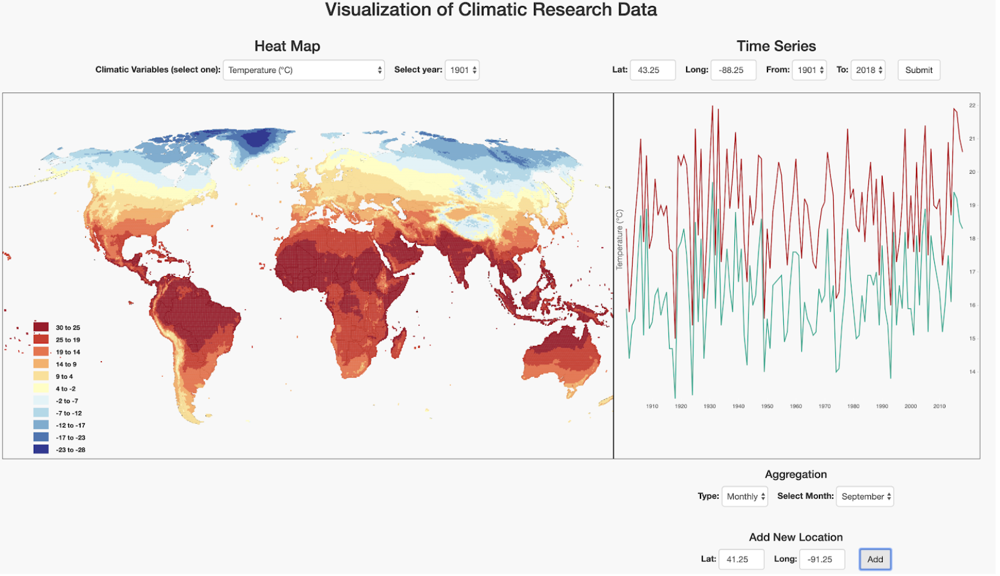

# Visualization of climatic research data to study glacier behaviors

# Data link: 
CRU-Ts: https://crudata.uea.ac.uk/cru/data/hrg/

Download the data netCDF files for all the 10 climate variables and use the Extract_Yearly/Monthly.R file(s) to convert the netCDF file into user readable csv format. Organize each variable into a separate directory
Convert the yearly csv files to geojson format for each variable for each year(1901-2018) using the csvToGeojsonScript.ipynb file.
Insert the monthly data into MongoDB with each climate variable as a document.
Use the src/js/backend.js file to query data from the database  

